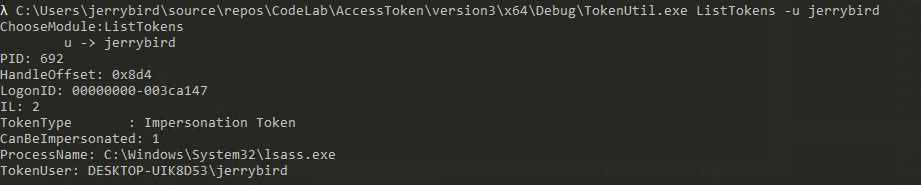
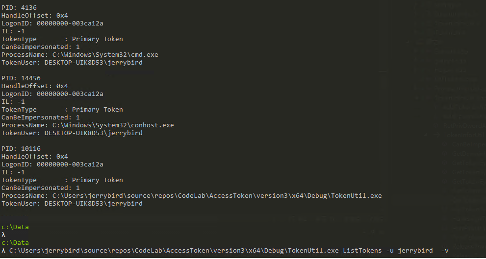
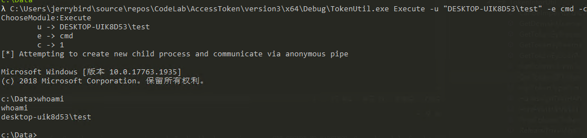

## 0x01 前言
详见[Zer0ne安全研究]公众号
## 0x02 介绍
本工具参考incognito的代码进行编写，完成了获取token和以某token执行命令两个功能。

在获取系统上所有token的时候，incognito工具使用NtQuerySystemInformation微软未公开API获取系统上所有的进程，然后再获取该进程上句柄表中的每一个句柄，判断是不是token句柄，若是则保存。
JCTokenUtils工具同样使用NtQuerySystemInformation微软未公开API，不过是直接获取系统上所有的句柄，之后判断是不是token句柄，若是则保存。由于句柄表中没有保存进程自身的主令牌，因而会使用OpenProcessTokenAPI获取并保存进程的主令牌。
以某个令牌执行命令，本工具基本参照incognito工具编写，没有区别。
## 0x03 使用
### 0x0301 命令介绍
```shell
Usage: TokenUtil.exe <module> [OPTION]

[MODULE]
        ListTokens
[OPTION]
        -p <pid>: 列出某个进程中的令牌
        -P <procName>: 列出某个进程的令牌
        -u <username>: 列出某个用户的令牌
        -v : 详细模式 // 不加-v，每个用户只输出一次

example:
        TokenUtils.exe ListTokens -u "NT AUTHORITY\SYSTEM"
        TokenUtils.exe ListTokens -P "cmd"
        TokenUtils.exe ListTokens -P "cmd" -u "NT AUTHORITY\SYSTEM"

[MODULE]
        Execute
[OPTION]
        -p <pid>: 以指定pid的token执行命令
        -u <username>: 以某个用户执行命令，与-e <command>结合使用
        -e <command> : 执行命令
        -c: 是否在当前终端下执行
        -v : 详细模式

example:
        TokenUtils.exe Execute -p <pid> -e whoami -c
        TokenUtils.exe Execute -u "NT AUTHORITY\SYSTEM" -e whoami -c
        TokenUtils.exe Execute -p <pid> -u "NT AUTHORITY\SYSTEM" -e whoami -c
```
### 0x0302 使用说明

	◊ -P -u参数值大小写敏感
	◊ 同时使用-P -u参数表示同时满足两个条件
	◊ 获取token时同一个用户只输出一次，使用-v参数，则输出所有用户
### 0x0303 使用效果
`TokenUtil.exe ListTokens -u jerrybird`

`TokenUtils.exe ListTokens -u jerrybird -v`

`TokenUtil.exe Execute -u "DESKTOP-UIK8D53\test" -e cmd -c`


